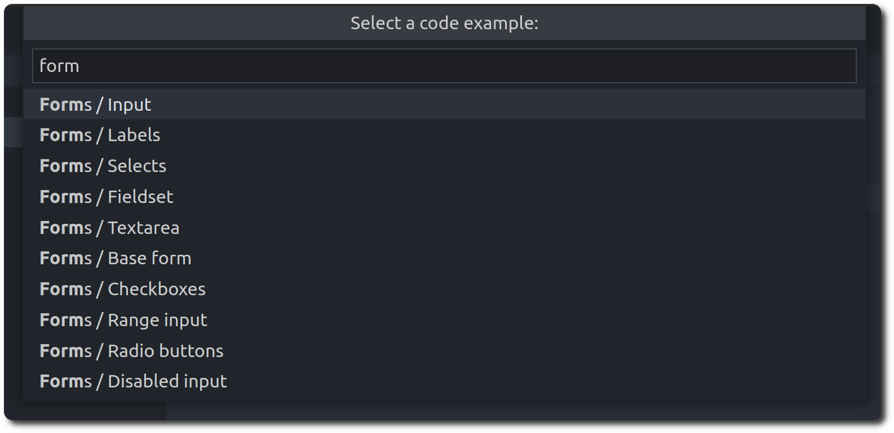
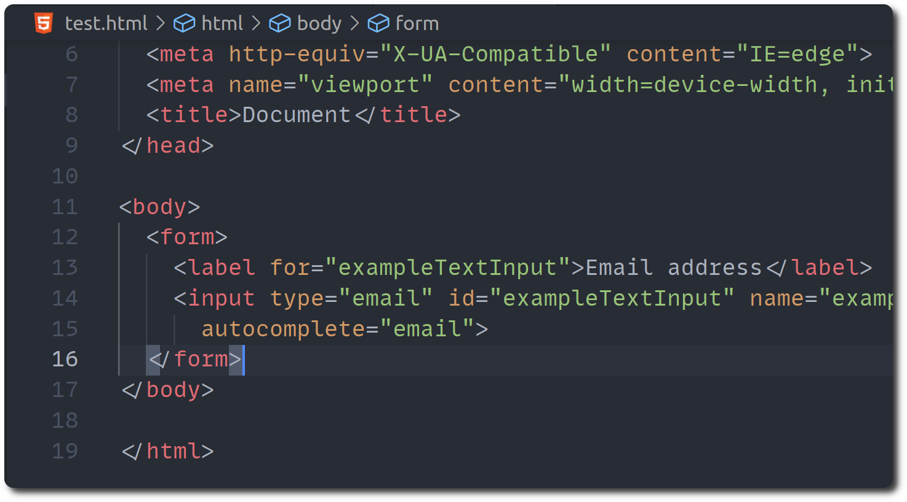

#  Vanilla Framework Intellisense

Intelligent Vanilla framework suggestions for VS Code.

## Features

### Class autocompletion for HTML files (.html)

Context aware autocompletion, where you only see the class that are suitable to the element that you are currently editing.

### `className` autocompletion for React files (.jsx, .tsx)

All the classes that you can use from the Vanilla Framework to make your life easier.

### Vanilla variables in style files (.scss)

Autocompletion for the variables that are provided by the Vanilla framework, you can change their value and sea the default value by hovering over the variable.

### Component examples as snippets:

All the [useful examples](https://vanillaframework.io/docs/examples) from the Vanilla framework [documentation page](https://vanillaframework.io/) are available as snippets that you can insert directly to your HTML code:

1. Run the command: `Vanilla Framework: insert a snippet`:

2. Choose an example to insert:

_This extension is in development, you may encounter performance issues. If you encounter a problem feel free to report [an issue](https://github.com/goulinkh/vanilla-framework-intellisense/issues)._
